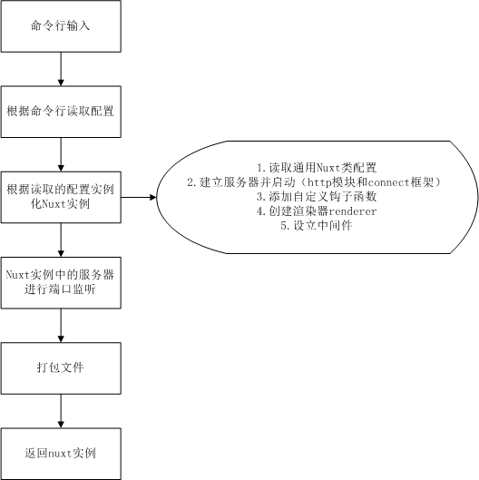
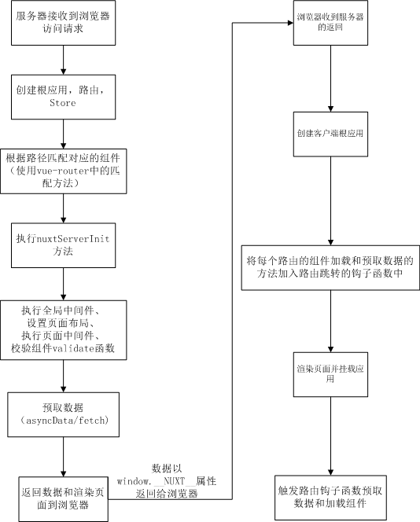
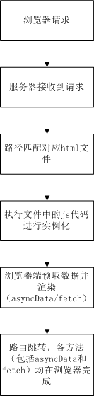

# Nuxt生命周期

**Nuxt：使用 vue-server-render 插件进行服务端渲染，并集成了vue-router、vuex的服务端渲染框架**

## 一、从命令行启动服务分析（以 nuxt 命令为例）

命令行调用文件 node_modules/nuxt/bin/nuxt.js：

```js
...
const suffix = require('../package.json').name.includes('-edge') ? '-edge' : ''
require('@nuxt/cli' + suffix).run() //引入对应的nuxt/cli 文件
  .catch((error) => {
    require('consola').fatal(error)
    process.exit(2)
  })
...
```

在 nuxt/cli.js 文件中，根据输入的命令行参数来加载对应的配置：

```javascript
// cli.js
async function run(_argv) {
  const argv = _argv ? Array.from(_argv) : process.argv.slice(2);
  let cmd = await __chunk_1.getCommand(argv[0]); 
  // 根据命令行参数加载对应的配置，并以NuxtCommand类实例化cmd，cmd则为一个包含客户端和服务端配置的实例
  ...
 // 加载配置之后，将具体配置传入 cmd 实例的 run 方法，并运行 
  if (cmd) {
    return __chunk_1.NuxtCommand.run(cmd, argv.slice(1))
  }
  ...
}
```

在 cmd 实例中，run 方法会根据传入的配置进行 Nuxt 类的实例化，得到所需的 nuxt 实例：

```javascript
// cli-chunk.js
class NuxtCommand{
  ...
  async run(cmd) {
    const { argv } = cmd;
    const nuxt = await this.startDev(cmd, argv, argv.open);
  }
  async startDev(cmd, argv) {
    const config = await cmd.getNuxtConfig({ dev: true, _build: true }); // 读取环境配置
    const nuxt = await cmd.getNuxt(config); // 实例化nuxt
    ...
    await nuxt.server.listen(); //实例化 nuxt 后，服务器进行端口监听
    ...
    const builder = await cmd.getBuilder(nuxt); // 根据 nuxt 实例配置进行文件打包
    await builder.build();
    ...
    return nuxt
  }
  ...
}
```

其中在实例化 nuxt 的过程中会执行以下操作：

```js
// core.js
class Nuxt extends Hookable {
  constructor(options = {}) {
    ...
    this.options = config.getNuxtConfig(options); // 读取通用配置
    this.resolver = new Resolver(this); // 创建路径解析器
    this.moduleContainer = new ModuleContainer(this); // 模块加载容器
		...
    this.showReady = () => { this.callHook('webpack:done'); };
    if (this.options.server !== false) {
      this._initServer();  // 初始化服务器实例，其中利用Node的http模块启动服务，利用 connect 框架进行请求响应的处理
    }
    ...
    // 调用nuxt实例的ready方法，其中ready方法即调用了 nuxt 实例的 _init 方法
    if (this.options._ready !== false) {
      this.ready().catch((err) => {
        consola.fatal(err);
      });
    }
  }
  async _init() {
    ...
    // 添加自定义周期钩子函数（如vue-renderer:ssr:prepareContext）
    if (isPlainObject_1(this.options.hooks)) {
      this.addHooks(this.options.hooks);
    } else if (typeof this.options.hooks === 'function') {
      this.options.hooks(this.hook);
    }
    ...
    // 执行 server 的 ready 方法
      if (this.server) {
        await this.server.ready();
      }
      await this.callHook('ready', this);
      return this
  }
  ...
}
// server.js
async ready() {
  ...
    const context = new ServerContext(this); // 实例化 server 上下文
    this.renderer = new VueRenderer(context); // 创建 renderer
    await this.renderer.ready();
  ...
    await this.setupMiddleware(); // 设立中间件并进行渲染
  ...
    await this.nuxt.callHook('render:done', this);
    return this
}
// 分析setupMiddleware
async setupMiddleware() {
    // 生产环境压缩中间件
    if (!this.options.dev) {
      const { compressor } = this.options.render;
      if (typeof compressor === 'object') {
        const compression = this.nuxt.resolver.requireModule('compression');
        this.useMiddleware(compression(compressor));
      } else if (compressor) {
        this.useMiddleware(compressor);
      }
    }
  ...
  	// 处理根目录static文件夹的路径映射
    const staticMiddleware = serveStatic(
      path.resolve(this.options.srcDir, this.options.dir.static),
      this.options.render.static
    );
    staticMiddleware.prefix = this.options.render.static.prefix;
    this.useMiddleware(staticMiddleware);
  ...
    this.useMiddleware(nuxtMiddleware({
      options: this.options,
      nuxt: this.nuxt,
      renderRoute: this.renderRoute.bind(this),
      resources: this.resources
    }));
  // nuxtMiddleware 返回的函数利用 vue-server-render 提供的方法生成 html 字符串，并返回给浏览器
  // 利用 renderer 的 renderRoute 方法，根据不同模式进行 SPA 或者 universal 模式的渲染
  ...
}
  
// vue-renderer.js
// renderer 的 ready 方法解析
async _ready() {
  ...
  await this.loadResources(fs); // 加载资源
  ...
}
async loadResources(_fs) {
  ...
  for (const resourceName in this.resourceMap) {
    const { fileName, transform, encoding } = this.resourceMap[resourceName]; // 加载部分模板和配置
    let resource = await readResource(fileName, encoding);
  }
  ...
  await this.loadTemplates(); // 读取 loading 和 error 时的模板文件
  ...
  this.createRenderer(); // 调用 vue-server-render 内的方法生成renderer
  ...
}
async renderRoute(url, context = {}, _retried) {
  if (!this.isReady) {
    // 生产环境调用
    if (!this.context.options.dev) {
      if (!_retried && ['loading', 'created'].includes(this._state)) {
        await this.ready();
        return this.renderRoute(url, context, true)
      }
	...
    }
  }
	...
  if (context.spa === undefined) {
    context.spa = !this.SSR || req.spa || (context.res && context.res.spa);
  }
  await this.context.nuxt.callHook('vue-renderer:context', context);
  // 根据SPA模式和SSR模式进行渲染
  return context.spa
    ? this.renderSPA(context)
    : this.renderSSR(context)
}
```

至此，由命令行启动的服务完成，主要流程概括



## 二、从浏览器访问 Nuxt 搭建的网站

用户通过浏览器访问网站时，主要访问流程根据 .nuxt 文件夹中的文件执行顺序一致

首先由 server.js 文件创建根应用（该部分在服务器端完成）

```js
// .nuxt/server.js
export default async (ssrContext) => {
  ...
  // 创建默认配置
  ssrContext.nuxt = { layout: 'default', data: [], error: null, state: null, serverRendered: true }
  ...
  // 创建根应用 _app，创建路由实例router和store实例
  const { app, router, store } = await createApp(ssrContext)
  const _app = new Vue(app)
  ...
  // 匹配对应的组件
  const Components = getMatchedComponents(router.match(ssrContext.url))
  
  // 执行 store 中的 nuxtServerInit 方法
  if (store._actions && store._actions.nuxtServerInit) {
    try {
      await store.dispatch('nuxtServerInit', app.context)
    } catch (err) {
      debug('error occurred when calling nuxtServerInit: ', err.message)
      throw err
    }
  }
  
  // 调用nuxt.config.js中配置的全局中间件
  let midd = []
  midd = midd.map((name) => {
    if (typeof name === 'function') return name
    if (typeof middleware[name] !== 'function') {
      app.context.error({ statusCode: 500, message: 'Unknown middleware ' + name })
    }
    return middleware[name]
  })
  await middlewareSeries(midd, app.context)
  
  // 根据匹配到的组件中的 layout 设置，加载对应的布局方式
  let layout = Components.length ? Components[0].options.layout : NuxtError.layout
  if (typeof layout === 'function') layout = layout(app.context)
  await _app.loadLayout(layout)
  if (ssrContext.nuxt.error) return renderErrorPage()
  layout = _app.setLayout(layout)
  ssrContext.nuxt.layout = _app.layoutName
  
  // 调用组件中设置的中间件方法
  midd = []
  layout = sanitizeComponent(layout)
  if (layout.options.middleware) midd = midd.concat(layout.options.middleware)
  Components.forEach((Component) => {
    if (Component.options.middleware) {
      midd = midd.concat(Component.options.middleware)
    }
  })
  midd = midd.map((name) => {
    if (typeof name === 'function') return name
    if (typeof middleware[name] !== 'function') {
      app.context.error({ statusCode: 500, message: 'Unknown middleware ' + name })
    }
    return middleware[name]
  })
  await middlewareSeries(midd, app.context)
  
  // 校验组件的validate函数是否有效，若函数执行报错则渲染错误页面并返回，
  let isValid = true
  try {
    for (const Component of Components) {
      if (typeof Component.options.validate !== 'function') continue
      isValid = await Component.options.validate(app.context)
      if (!isValid) break
    }
  } catch (validationError) {
    app.context.error({
      statusCode: validationError.statusCode || '500',
      message: validationError.message
    })
        return renderErrorPage()
  }
  ...
  if (!Components.length) return render404Page() // 若匹配不到对应的组件则渲染404页面返回
  ...
 	// 服务端预取数据过程
  const asyncDatas = await Promise.all(Components.map((Component) => {
    const promises = []
    // 调用组件的 asyncData 方法获取数据
    if (Component.options.asyncData && typeof Component.options.asyncData === 'function') {
      const promise = promisify(Component.options.asyncData, app.context)
      promise.then((asyncDataResult) => {
        ssrContext.asyncData[Component.cid] = asyncDataResult
        applyAsyncData(Component)
        return asyncDataResult
      })
      promises.push(promise)
    } else {
      promises.push(null)
    }
    // 调用组件的 fetch 方法获取数据
    if (Component.options.fetch) {
      promises.push(Component.options.fetch(app.context))
    } else {
      promises.push(null)
    }
    return Promise.all(promises)
    }))
  // 将服务器预取得到的数据注入到渲染上下文，最后通过 window.__NUXT__ 属性返回给浏览器
  ssrContext.nuxt.data = asyncDatas.map(r => r[0] || {})
  
  // 调用 beforeRender 方法，包括调用组件的 beforeNuxtRender 方法，并将 store 的状态注入到 渲染上下文
  // 并执行第一步分析中的 renderer 实例中的 renderRoute 方法生成 html 字符串返回给浏览器
  await beforeRender()
  return _app
}
```


浏览器获取到服务器返回的 html 字符串以及预取数据之后，将根据预取的数据进行客户端根应用的实例化

```js
// .nuxt/client.js
...
const NUXT = window.__NUXT__ || {} // 获取预取数据
...
createApp()
  .then(mountApp)
  .catch((err) => {
    const wrapperError = new Error(err)
    wrapperError.message = '[nuxt] Error while mounting app: ' + wrapperError.message
    errorHandler(wrapperError)
  })
// 创建客户端根应用并进行挂载
...

async function mountApp(__app) {
  app = __app.app
  router = __app.router
  store = __app.store
  ...
  const Components = await Promise.all(resolveComponents(router))  // 匹配对应的组件
  const _app = new Vue(app)  // 创建根应用
  ...
  // 对每个路由跳转之前进行组件的加载以及数据的预取（asyncData和fetch）
  router.beforeEach(loadAsyncComponents.bind(_app))
  router.beforeEach(render.bind(_app))
  ...
  // 接收到由服务端渲染好的页面，直接挂载到相应的DOM节点
  if (NUXT.serverRendered) {
    mount()
    return
  }
  ...
}
  
```



## 三、SPA模式下的生命周期

在 SPA 模式下，nuxt 则会按照普通 vue 单页应用进行运行，不会进行服务端渲染，而采用客户端渲染；服务器接收到浏览器的请求之后，匹配返回对应路径的 html 文件之后（dist文件夹中），执行其中的 js 代码，进行实例化，其中原本在服务端进行的 asyncData 和 fetch 方法则改在浏览器端进行，执行顺序不变（仍是在匹配出对应路由组件之后）

